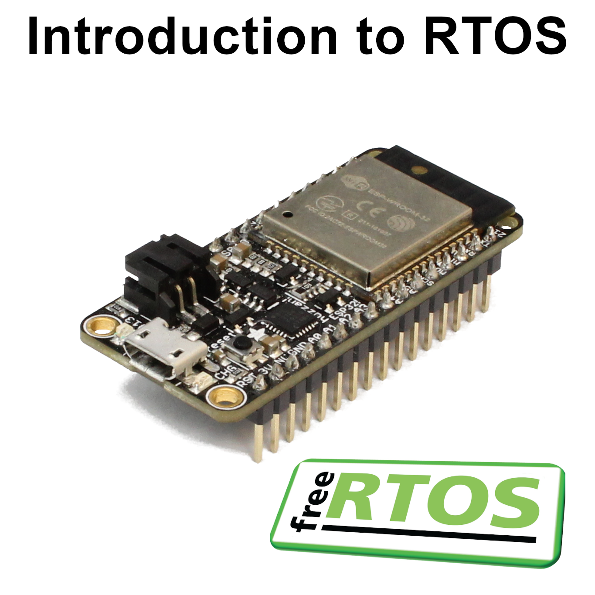

# Introduction to Real Time Operating Systems (RTOS)

Welcome to the demo code and solutions section of my Introduction to RTOS course! This repository houses all of the example code and solutions that you may use as references when working through the RTOS examples for FreeRTOS. 

